  

  

 

 

## &nbsp;&nbsp;Sobre mí

> Estudiante de cuarto año de **Ingeniería de Software** en la **Universidad Tecnológica de Panamá (UTP)**, con experiencia práctica como desarrollador en el sector ERP y formación sólida en bases de datos, backend y procesamiento de lenguaje natural (NLP).
>
> He coordinado equipos en proyectos académicos aplicando principios sólidos de ingeniería de software, modelado de datos y metodologías ágiles. Complemento mi formación con certificaciones en AWS, ciencia de datos e inteligencia artificial.

## &nbsp;&nbsp;Stack Tecnológico

  

## &nbsp;&nbsp;Proyectos Destacados

<table>
<tr>
<td width="50%" valign="top">

### Pipeline de NLP
Pipeline estructurado en fases (léxico, sintáctico y semántico) inspirado en arquitectura de compiladores. Análisis de sentimientos con Transformers, modelado de temas con LDA y vectorización TF-IDF. Detección de idioma, traducción y generación con GPT-2.

</td>
<td width="50%" valign="top">

### Gestión de Bienestar Estudiantil
Aplicación web con levantamiento de requerimientos vía casos de uso e historias de usuario. Base de datos relacional normalizada (3FN), autenticación, control de acceso por roles y CRUD completo.

</td>
</tr>
<tr>
<td width="50%" valign="top">

### BD de Tienda Tecnológica
Modelo entidad-relación y esquema relacional para ventas, inventario, clientes y servicios técnicos. Más de 15 tablas normalizadas (3FN), consultas SQL avanzadas, procedimientos almacenados, triggers y vistas.

</td>
<td width="50%" valign="top">

### Hackathon Copa Airlines 2025
Solución de monitoreo de vuelos construida con Databricks y AWS SageMaker durante el hackathon.

</td>
</tr>
</table>

> Convierte cada título en un enlace a su repositorio así: `### [Pipeline de NLP](https://github.com/Fernando-lezcano/nombre-repo)`

## &nbsp;&nbsp;Certificaciones

**Machine Learning · Ciencia de Datos e IA**
- **AWS Academy Graduate** — Machine Learning for Natural Language Processing | Amazon Web Services
- **Data Science Essentials With Python** — Cisco
- **Samsung Innovation Campus** — Python e Inteligencia Artificial | Samsung
- **Hackathon Copa Airlines 2025** — Solución de monitoreo de vuelos con Databricks y AWS SageMaker | Copa Airlines

**Desarrollo y Tecnologías**
- **Curso Profesional de Base de Datos** — Código Facilito
- **Curso Profesional de JavaScript** — Código Facilito
- **Fundamentos de Python 1** — Cisco
- **Computer Network** — Huawei

**Metodologías**
- **Scrum Fundamentals Certified (SFC™)** — SCRUMstudy, 2026

**Idiomas**
- Español: Nativo
- Inglés: Intermedio (B1) — Centro Especializado en Lenguas (CEL), 2022
- Inglés para IT (B1 Alto) — Cisco, 2024

### ¿Trabajamos juntos?

